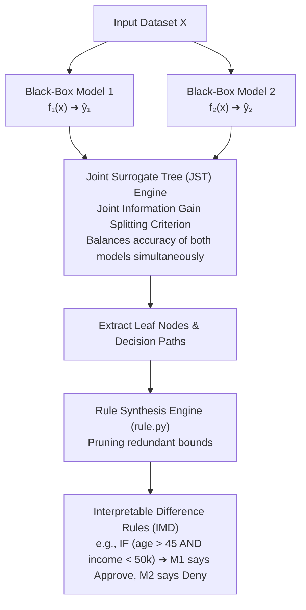

# Interpretable Differencing of ML Models using Joint Surrogate Trees (JST)

[](https://www.python.org/)
[]()
[](https://scikit-learn.org/)
[](https://www.cse.iitb.ac.in/)

> **Academic Affiliation**: Course Project for **Artificial Intelligence and Machine Learning (CS 725 / CS 337)**, IIT Bombay  
> **Guide**: **Prof. Pushpak Bhattacharyya**  
> **Author**: **Dheeraj Kumar Maradana** ([@dheerajkumar2005](https://github.com/dheerajkumar2005))

---

## 📌 Problem Motivation

When deploying machine learning systems in high-stakes domains (healthcare, fraud detection, autonomous systems), practitioners frequently face the challenge of **Model Differencing**:
* How do the decision boundaries of a newly updated deep neural network differ from the legacy production model?
* In what input sub-spaces do an ensemble model and a specialized model disagree?

Conventional post-hoc explainers (such as LIME or SHAP) explain individual instance predictions in isolation. They fail to describe global regions of model divergence. 

**Joint Surrogate Trees (JST)** resolve this by fitting a single, interpretable decision tree across the predictions of two black-box models simultaneously, directly extracting compact, human-readable propositional rules representing model disagreement regions.

---

## 🏗️ Architecture & Algorithm



### Core Components:
1. **`jst.py` (Joint Surrogate Tree)**: Custom recursive tree induction algorithm utilizing a joint splitting criterion that optimizes simultaneous fidelity to both models $\hat{y}_1$ and $\hat{y}_2$.
2. **`imd.py` (Interpretable Model Differencing Explainer)**: High-level `IMDExplainer` interface supporting both classification and regression targets. Automatically maps continuous regression differentials into disagreement regions.
3. **`rule.py` (Rule Engine)**: Converts leaf node constraint sets into clean human-readable bounding rules, with support for coverage evaluation and rule simplification.

---

## 📊 Visualizing Decision Boundaries

Comparison between independently trained surrogate trees vs. the **Joint Surrogate Tree (JST)**:

| Separate Surrogate Trees | Joint Surrogate Tree (JST) |
|:---:|:---:|
| Disjoint boundaries, fragmented disagreement regions | Aligned partitions, explicit boundary difference isolation |

---

## 🚀 Quickstart & Usage

### 1. Installation
```bash
git clone https://github.com/dheerajkumar2005/Joint-Surrogate-Trees-Model-Differencing.git
cd Joint-Surrogate-Trees-Model-Differencing
pip install numpy pandas scikit-learn matplotlib
```

### 2. Python API Example
```python
import pandas as pd
from imd import IMDExplainer

# Load tabular dataset
X_train = pd.read_csv("data.csv")

# Obtain predictions from two black-box models
y_pred_model1 = model_1.predict(X_train)
y_pred_model2 = model_2.predict(X_train)

# Fit IMD Explainer
explainer = IMDExplainer()
explainer.fit(
    X_train, 
    y_pred_model1, 
    y_pred_model2, 
    max_depth=5, 
    task='classification'
)

# Print human-readable disagreement rules
for rule in explainer.diffrules:
    print(rule)
```

Interactive demonstrations are provided in [`imd_example.ipynb`](imd_example.ipynb) and [`imd_example1.ipynb`](imd_example1.ipynb).
